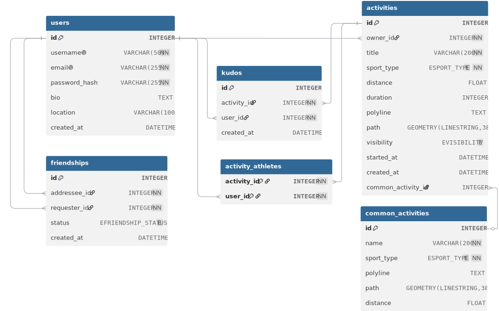

# RunBanditsRun

> A social fitness tracker — record runs, rides, walks, and hikes with GPS routes; follow friends and see their activities in a feed; compete on shared routes via auto-built leaderboards. **Mini-Strava, scoped to a DB course project.**

**Deployed:** [run.emptinessof.space](https://run.emptinessof.space) &nbsp;·&nbsp; **Demo:** [`presentation/demo.mov`](presentation/demo.mov) &nbsp;·&nbsp; **Slides:** [`presentation/presentation.html`](presentation/presentation.html)

---

## Contents

- [Stack](#stack)
- [Domain & Entities](#domain--entities)
- [Schema](#schema)
- [Seed data](#seed-data)
- [Queries](#queries)
- [Running locally](#running-locally)
- [Tests & tooling](#tests--tooling)

---

## Stack

| Layer    | Tech                                                       |
| -------- | ---------------------------------------------------------- |
| Backend  | FastAPI · SQLAlchemy · PostgreSQL 16 · PostGIS             |
| Frontend | React · Vite · React Query · React Router · Leaflet        |
| Infra    | Docker Compose (db + backend)                              |

---

## Domain & Entities

**Domain:** *social fitness tracking.* The unit of content is an **activity** — a GPS-recorded effort with a sport type (`run`, `ride`, `walk`, `hike`), distance, duration, and an encoded polyline of the route.

### Entities

| Entity                | What it is                                                                                                                                                                                                                |
| --------------------- | ------------------------------------------------------------------------------------------------------------------------------------------------------------------------------------------------------------------------- |
| **users**             | Accounts (username, email, password hash, bio, location).                                                                                                                                                                 |
| **activities**        | What a user did. Has `polyline` (compact text) **and** a PostGIS `GEOMETRY(LINESTRING, 3857)` `path` for spatial queries. `visibility` ∈ {`public`, `friends`, `private`}, optional `common_activity_id` link.            |
| **common_activities** | Shared/known routes. **Killer entity** — when a user's activity is similar to a common route (Fréchet ≤ 25 m, within 100 m corridor), it auto-links, powering leaderboards across users on the same route.               |
| **friendships**       | Bidirectional edge stored once (`requester_id`, `addressee_id`, `status` ∈ {`pending`, `accepted`}). Feed reads it in both directions via `UNION`.                                                                        |
| **kudos**             | Likes on activities. `(activity_id, user_id)` unique.                                                                                                                                                                     |
| **activity_athletes** | Many-to-many for group activities (composite PK).                                                                                                                                                                         |

### Critical user paths

1. **Upload an activity** → polyline decoded to `LINESTRING` via PostGIS `decode_polyline_to_geom`, similarity-matched against `common_activities`, linked on match.
2. **Open the feed** → activities of self + accepted friends (respecting `visibility`), sorted by `started_at DESC`, kudos counted.
3. **Open a leaderboard** → fastest `duration` per athlete on a given `common_activity_id`, public activities only.

### Reconstruction checklist

> Six tables (`users`, `activities`, `common_activities`, `friendships`, `kudos`, `activity_athletes`), three enums (`sport_type`, `visibility`, `friendship_status`), the **PostGIS** extension, **GIST** indexes on both `path` columns, **btree** indexes on the foreign keys hit in joins (`owner_id`, `common_activity_id`, `activity_id`, `user_id`, `requester_id`, `addressee_id`).

---

## Schema



**Sources:** [`presentation/schema.svg`](presentation/schema.svg) · DBML at [`backend/schema.dbml`](backend/schema.dbml) · DDL at [`backend/db/init_db.sql`](backend/db/init_db.sql).

### Highlights

- `GEOMETRY(LINESTRING, 3857)` on `activities.path` and `common_activities.path` — Web Mercator projection lets `ST_Distance` return meters directly.
- **GIST** indexes on both `path` columns — bounding-box indexes used by `ST_DWithin` / `ST_Intersects` during similarity matching.
- Three DB-level enums: `ESPORT_TYPE`, `EVISIBILITY`, `EFRIENDSHIP_STATUS`.

<details>
<summary><b>Full DBML</b> (click to expand)</summary>

```dbml
Table users {
  id INTEGER [pk, increment]
  username VARCHAR(50) [not null, unique]
  email VARCHAR(255) [not null, unique]
  password_hash VARCHAR(255) [not null]
  bio TEXT
  location VARCHAR(100)
  created_at DATETIME [default: `now()`]
}

Table activities {
  id INTEGER [pk, increment]
  owner_id INTEGER [not null]
  title VARCHAR(200) [not null]
  sport_type ESPORT_TYPE [not null]
  distance FLOAT
  duration INTEGER
  polyline TEXT
  path GEOMETRY(LINESTRING, 3857)
  visibility EVISIBILITY [default: 'public']
  started_at DATETIME
  created_at DATETIME [default: `now()`]
  common_activity_id INTEGER

  indexes {
    (owner_id)
    (path) [type: GIST]
    (common_activity_id)
  }
}

Table common_activities {
  id INTEGER [pk, increment]
  name VARCHAR(200) [not null]
  sport_type ESPORT_TYPE [not null]
  polyline TEXT
  path GEOMETRY(LINESTRING, 3857)
  distance FLOAT

  indexes {
    (path) [type: GIST]
  }
}

Table friendships {
  id INTEGER [pk, increment]
  requester_id INTEGER [not null]
  addressee_id INTEGER [not null]
  status EFRIENDSHIP_STATUS [default: 'pending']
  created_at DATETIME [default: `now()`]

  indexes {
    (requester_id)
    (addressee_id)
  }
}

Table kudos {
  id INTEGER [pk, increment]
  activity_id INTEGER [not null]
  user_id INTEGER [not null]
  created_at DATETIME [default: `now()`]

  indexes {
    (activity_id)
    (user_id)
  }
}

Table activity_athletes {
  activity_id INTEGER [not null]
  user_id INTEGER [not null]

  indexes {
    (activity_id, user_id) [pk]
  }
}

Enum ESPORT_TYPE   { run ride walk hike }
Enum EVISIBILITY   { public friends private }
Enum EFRIENDSHIP_STATUS { pending accepted }

Ref: activities.owner_id           > users.id
Ref: activities.common_activity_id > common_activities.id
Ref: friendships.requester_id      > users.id
Ref: friendships.addressee_id      > users.id
Ref: kudos.activity_id             > activities.id
Ref: kudos.user_id                 > users.id
Ref: activity_athletes.activity_id > activities.id
Ref: activity_athletes.user_id     > users.id
```

</details>

---

## Seed data

Seed data lives at [`backend/db/populate.sql`](backend/db/populate.sql) — `INSERT`-only, safe to run after `init_db.sql`. It seeds ~10 users, 4 common routes, ~20 activities, friendships, and kudos. All polylines are real (generated via `ST_AsEncodedPolyline`).

**Docker Compose** *(recommended — DDL is auto-applied via the entrypoint mount)*

```bash
docker compose up -d db
docker compose exec -T db psql -U runbandits -d runbandits < backend/db/populate.sql
```

**Local Postgres** *(PostGIS extension required)*

```bash
psql -U runbandits -d runbandits -f backend/db/init_db.sql
psql -U runbandits -d runbandits -f backend/db/populate.sql
```

> For backend tests, [`backend/tests/conftest.py`](backend/tests/conftest.py) sets up isolated fixtures — `pytest backend/tests/` is all you need.

---

## Queries

The three story-queries from the presentation. The two non-trivial reads are also kept in [`backend/queries.sql`](backend/queries.sql).

### 1. Common-activity matching (write path)

```sql
-- Insert common route
INSERT INTO common_activities (name, sport_type, polyline)
VALUES ('Central Park Loop', 'run', :polyline)
RETURNING id, path;

-- Reject if a similar route already exists
SELECT 1 FROM common_activities ca
WHERE ca.sport_type = 'run'
  AND ca.id != :ca_id
  AND ST_DWithin(ca.path, :ca_path, 100)
  AND ST_FrechetDistance(ca.path, :ca_path, 0.05) < 25;

-- Bulk-link matching activities
UPDATE activities SET common_activity_id = :ca_id
WHERE id IN (
  SELECT a.id FROM activities a
  WHERE a.sport_type = 'run'
    AND a.common_activity_id IS NULL
    AND a.path IS NOT NULL
    AND ST_DWithin(a.path, :ca_path, 100)
    AND ST_FrechetDistance(a.path, :ca_path, 0.05) < 25
);
```

> `ST_DWithin` is the cheap GIST-backed prefilter; `ST_FrechetDistance` is the expensive confirmer applied only to survivors.

**Result** *(typical run)*

| step                | returns                                                       |
| ------------------- | ------------------------------------------------------------- |
| `INSERT … RETURNING` | `id = 5`, `path = LINESTRING(...)` decoded from the polyline  |
| dedupe `SELECT`     | empty — no near-duplicate exists, safe to keep                |
| bulk `UPDATE`       | `3 rows affected` — three matching public runs were auto-linked |

### 2. Friends feed

```sql
SELECT
  a.id, a.title, u.username,
  ROUND((a.distance / 1000.0)::numeric, 2) AS distance_km,
  COUNT(k.id)                              AS kudos
FROM activities a
JOIN users u ON u.id = a.owner_id
LEFT JOIN kudos k ON k.activity_id = a.id
WHERE a.visibility = 'public'
   OR a.owner_id = :viewer_id
   OR (a.visibility = 'friends' AND a.owner_id IN (
        SELECT addressee_id FROM friendships
          WHERE requester_id = :viewer_id AND status = 'accepted'
        UNION
        SELECT requester_id FROM friendships
          WHERE addressee_id = :viewer_id AND status = 'accepted'
      ))
GROUP BY a.id, u.username, a.distance, a.duration, a.started_at
ORDER BY a.started_at DESC;
```

**Result** *(viewer = `alice_runner`, against seeded data)*

| id | title                        | athlete          | distance_km | kudos |
| -- | ---------------------------- | ---------------- | ----------- | ----- |
| 4  | Mount Tam ride               | bob_cyclist      | 56.0        | 5     |
| 11 | Central Park Walk            | eve_walker       | 5.0         | 0     |
| 1  | Morning Long Run             | alice_runner     | 16.5        | 3     |
| 13 | 5K Race                      | frank_runner     | 5.0         | 2     |
| 12 | Hudson River Greenway        | eve_walker       | 3.8         | 0     |
| 5  | Golden Gate Bridge loops     | bob_cyclist      | 42.3        | 3     |
| 2  | Tempo Run on Esplanade       | alice_runner     | 8.2         | 1     |
| 14 | Lakefront 10K                | frank_runner     | 10.0        | 3     |
| 9  | Longs Peak Ascent            | diana_hiker      | 14.5        | 5     |
| 10 | Rocky Mountain NP Trail      | diana_hiker      | 8.7         | 1     |
| 15 | Ironman Training - Long Bike | grace_triathlete | 112.0       | 6     |
| 17 | Brick Workout - Bike to Run  | grace_triathlete | 10.0        | 2     |
| 18 | Gravel Century               | henry_cyclist    | 100.0       | 4     |
| 19 | Forest Park Loops            | henry_cyclist    | 25.5        | 0     |

### 3. Leaderboard for a common route

```sql
SELECT u.id            AS athlete_id,
       u.username      AS athlete_name,
       MIN(a.duration) AS best_time
FROM activities a
JOIN users u ON u.id = a.owner_id
JOIN common_activities ca ON ca.id = a.common_activity_id
WHERE ca.id = :ca_id
  AND a.visibility = 'public'
  AND a.duration IS NOT NULL
GROUP BY u.id, u.username
ORDER BY MIN(a.duration)
LIMIT 10;
```

**Result** *(`ca_id = 1`, "Charles River Long Run")*

| athlete_id | athlete_name     | best_time |
| ---------- | ---------------- | --------- |
| 4          | diana_hiker      | 6120      |
| 7          | grace_triathlete | 6180      |
| 1          | alice_runner     | 6240      |
| 6          | frank_runner     | 6300      |
| 11         | kevin_sprinter   | 6360      |
| 9          | ian_runner       | 6420      |
| 8          | henry_cyclist    | 6480      |
| 2          | bob_cyclist      | 6600      |
| 10         | julia_trail      | 6960      |
| 5          | eve_walker       | 7200      |

> `best_time` is in seconds (`a.duration`).

---

## Running locally

### Docker Compose *(easy path)*

Brings up Postgres+PostGIS with `init_db.sql` auto-applied, plus the backend.

```bash
docker compose up --build
# backend reachable at http://localhost:5433
```

### Manual

```bash
# Backend (port 8000)
pip install -r backend/requirements.txt
python -m uvicorn backend.main:app --reload

# Frontend (port 5173, proxies /api -> backend)
cd frontend && npm install && npm run dev
```

Then open <http://localhost:5173>.

---

## Tests & tooling

```bash
# Backend tests
pytest backend/tests/

# Frontend build check
cd frontend && npm run build

# Lint
ruff check backend
ruff check --fix backend
```
